# :books: My-Library API

Este projeto é uma API backend que simula o fluxo de empréstimo de livros de uma biblioteca, indo do cadastro de livros/gêneros/editoras/usuários até empréstimos feitos pelos usuários. 

## :hammer: Status do Projeto

> :construction: Projeto em construção :construction:

Quero utilizar esse projeto para continuar estudando e me aprimorando, então pretendo aplicar novas tecnologias e conceitos ao longo do tempo.

## :hammer_and_wrench: Tecnologias utilizadas

- **Java 17, SpringBoot 3.5.10, SpringSecurity, JavaJWT**
- **Maven 3.8.4**
- **Postgres 16**
- **Flyway**
- **Docker, Docker compose**
- **SwaggerAPI 2.7.0**

## :ballot_box_with_check: Funcionalidades

- Cadastro e listagem de editoras, gêneros, autores e livros.
- Cadastro automático de copias de livros.
- Registro e login de usuário.
- Registro de empréstimo de cópias.
- Controle de cópias disponíveis e não disponíveis.
- Controle de autenticação e autorização de usuários.


## :open_file_folder: Arquitetura do Sistema

```
library/
├── config       # Diretório que armazena as configurações do SpringSecurity e Swagger
├── controller   # Diretório que armazena os endpoints da aplicação
├── dto          # Diretório responsável pela transferência de dados   
├── exception    # Diretório responsável para envio de respostas em caso de exceção
├── mapper       # Diretório responsável em transformar os DTOs em Entidades e vice-versa
├── model        # Diretório que armazena as entidades da aplicação
├── repository   # Diretório responsável pela interação com o banco de dados
└── service      # Diretório responsável pelas regras de negócio da aplicação
```

### Fluxo de Dados

Abaixo, descrevo como uma requisição (ex: registrar um empréstimo) navega pela aplicação:

#### 1. Controller (Camada de Exposição):
- É o ponto de entrada da API. 
- Recebe o DTO (AddLoanRequest), valida os dados de entrada e delega a execução para o Service.

#### 2. Service (Camada de Negócio):
- Verifica regras de negócio, como se o usuário possui infrações pendentes antes de permitir um novo empréstimo.

#### 3. Repository (Camada de Persistência):
- Utiliza Spring Data JPA para realizar operações no banco de dados, fazendo a persistência dos dados.

#### 4. Mapper:
- Uma camada auxiliar que transforma Entidades (Objetos que referenciam registros no banco de dados) em DTOs (resposta da API), garantindo que dados sensíveis não sejam expostos desnecessariamente.

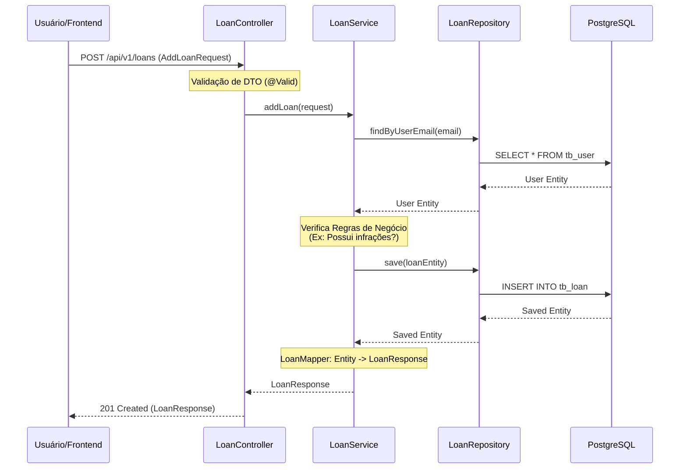

## :arrow_forward: Como Executar o Projeto

### 1. Pré requisitos
- Docker instalado

### 2. Configuração
Clone o repositório

```
git clone https://github.com/Luan-Cerqueira/library.git
```

Defina as variáveis de ambiente de acordo com o arquivo ```.git.example```

```
# Database
POSTGRES_DB=<seu-banco-de-dados>
POSTGRES_USER=<seu-usuario-do-banco-de-dados>
POSTGRES_PASSWORD=<sua-senha>
DB_HOST=<o-host-do-banco-de-dados>
DB_PORT=<a-porta> # normalmente 5432

# App
APP_PORT=<a-porta-da-aplicação> # normalmente 8080
API_SECURITY_TOKEN=<chave-de-segurança-para-o-token-jwt>
```

### 3. Executar

```
cd library
docker-compose up --build
```

A documentação da API ficará disponível em ```localhost:8080/swagger-ui/index.html```

O servidor ficará disponível em localhost:8080 (ou em outra porta que você tenha configurado).

## :desktop_computer: Demonstração de Funcionalidades

### Genre
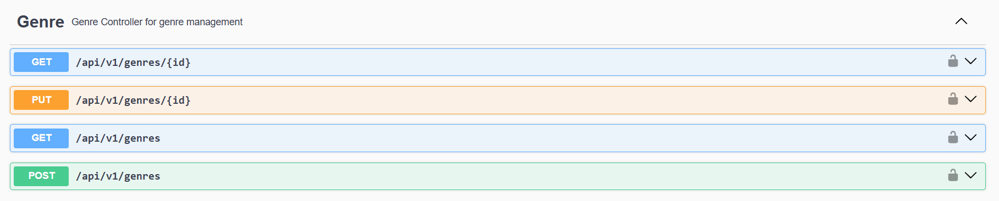
#### POST ```/api/v1/genres```

**Descrição:** O usuário do tipo administrador pode cadastrar um gênero.

**Request Body:**
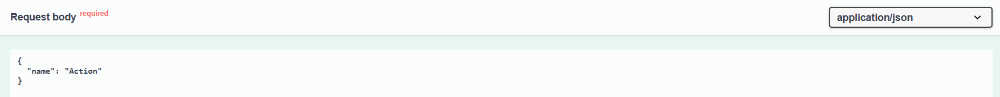

**Response Body:**
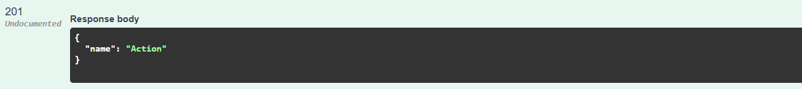

#### GET ```/api/v1/genres```
**Descrição:** Lista os gêneros cadastrados para qualquer usuário.
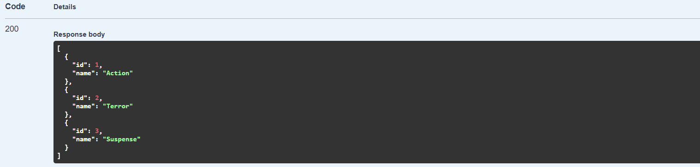


### Publisher
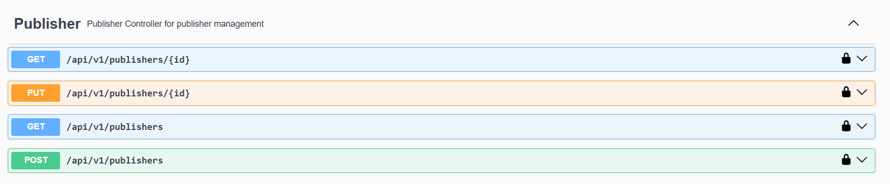

#### POST ```/api/v1/publishers```
**Descrição:** O usuário do tipo administrador pode cadastrar uma editora.

**Request Body:** 
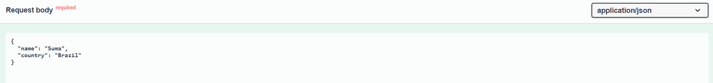

**Response Body:**
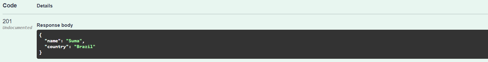

#### GET ```/api/v1/publishers```
**Descrição:** Lista as editoras cadastradas para qualquer usuário.
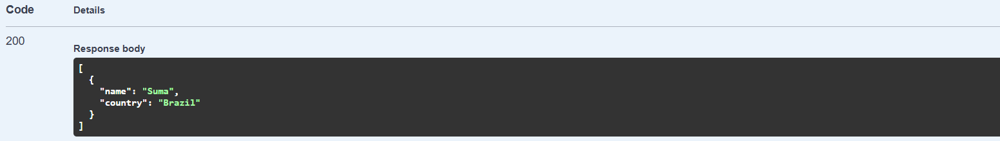

### Author
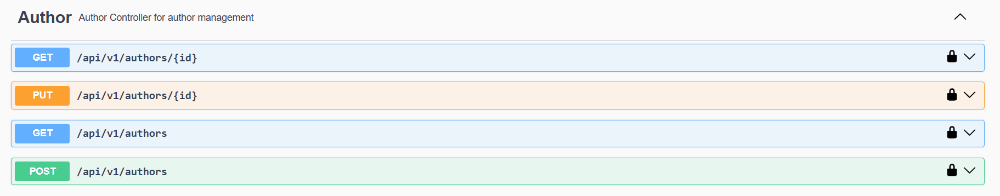

#### POST ```/api/v1/authors```
**Descrição:** O usuário do tipo administrador pode cadastrar um autor.

**Request Body:**
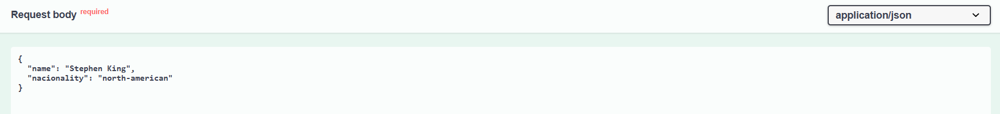

**Response Body:**
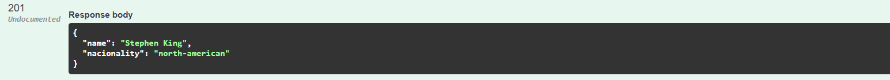

#### GET ```/api/v1/authors```
**Descrição:** Lista os autores cadastrados para qualquer usuário.
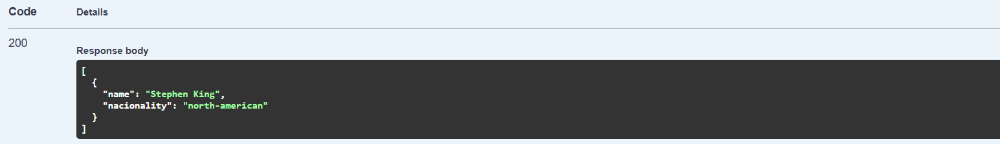

### Book
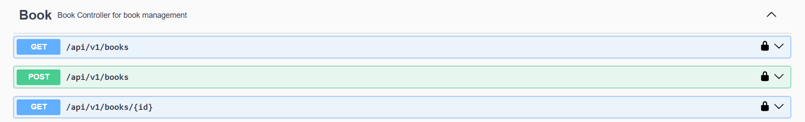

#### POST ```/api/v1/books```
**Descrição:** O usuário do tipo administrador pode cadastrar um livro.

**Request Body:**
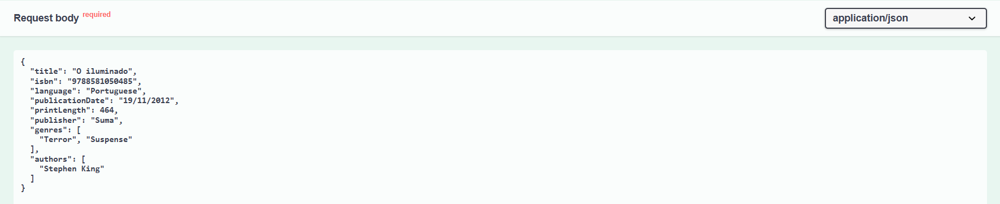

**Response Body:**
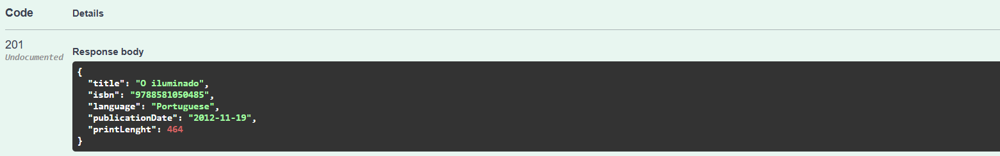

#### GET ```/api/v1/books```
**Descrição:** Lista os livros cadastrados para qualquer usuário.
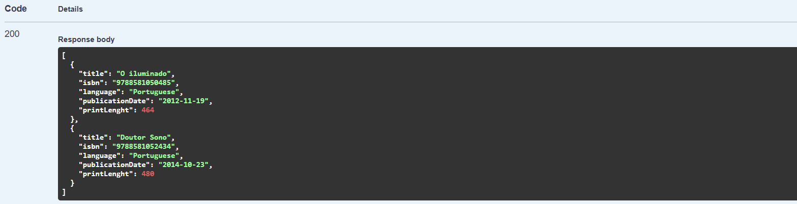

### BookCopy
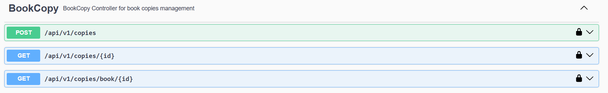

#### POST ```/api/v1/copies```
**Descrição:** O usuário do tipo administrador pode cadastrar cópias de um livro.

**Request Body:**
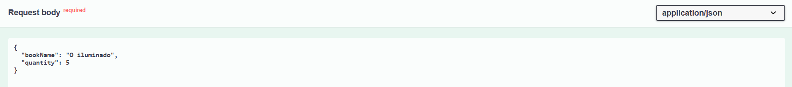

**Response Body:**
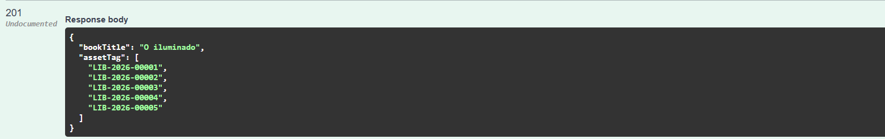

#### GET ```/api/v1/copies/book/{id}```
**Descrição:** Lista as cópias de determinado livro cadastrado para qualquer usuário.
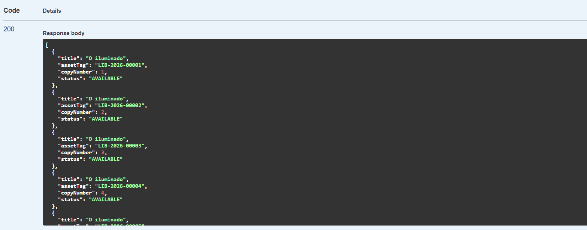

### Auth
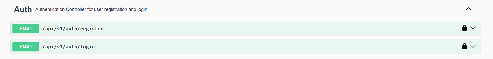

#### POST ```/api/v1/auth/register```
**Descrição:** Qualquer usuário pode se cadastrar no sistema.

**Request Body:**
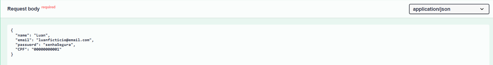

**Response Body:**
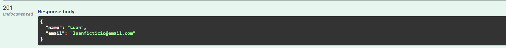

#### POST ```/api/v1/auth/login```
**Descrição:** Usuários cadastrados conseguem fazer login no sistema e recebem um token para acessar as funcionalidades de usuário.

**Request Body:**
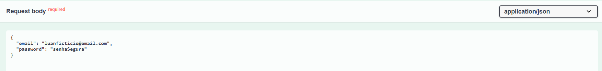

**Response Body:**
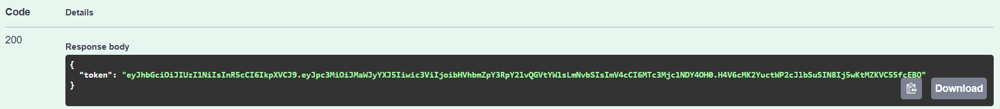

**Login no Swagger**<br/>
Para utilizar as funcionalidades reservadas para usuários comuns/admin é necessário que o usuário coloque o token gerado durante o login em ```Authorize```.
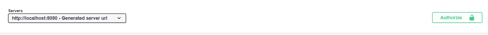
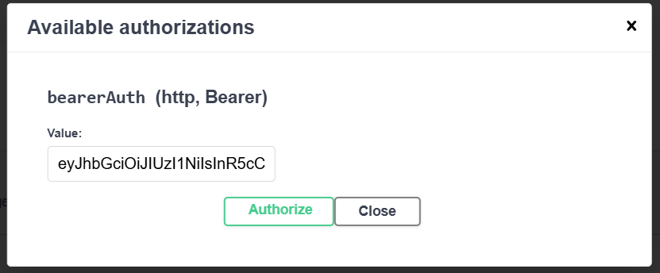
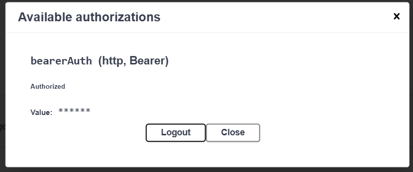


### Loan
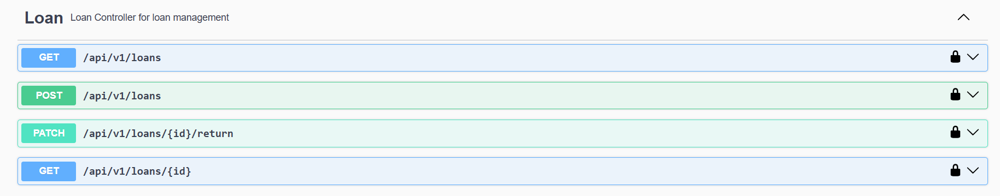

#### POST ```/api/v1/loans```
**Descrição:** O usuário do tipo administrador pode vincular o empréstimo de um livro a um usuário.

**Request Body:**
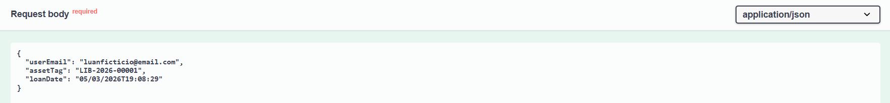

**Response Body:**
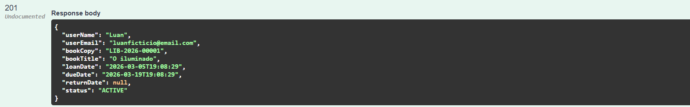

#### GET ```/api/v1/loans```
**Descrição:** É possível que o usuário do tipo administrador verifique todos os empréstimos feitos.
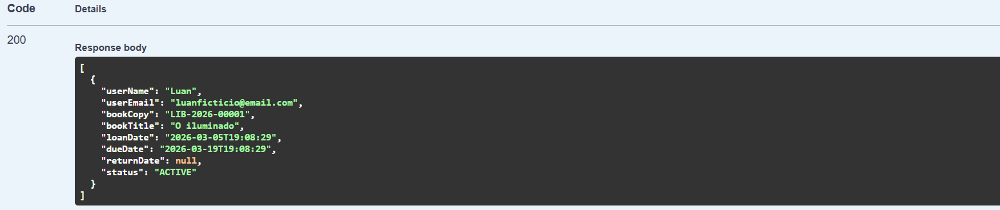

#### PATCH ```/api/v1/loans/{id}/return```
**Descrição:** É possível que o usuário do tipo administrador registre o retorno de um empréstimo. 
Podendo citar ou não a data de retorno, caso a data não seja especificada, o sistema utiliza a data atual como data de retorno. 
O administrador também pode detalhar se houve alguma infração no momento do retorno, como retorno atrasado, avariado ou perdido.

**Request Body sem infração**
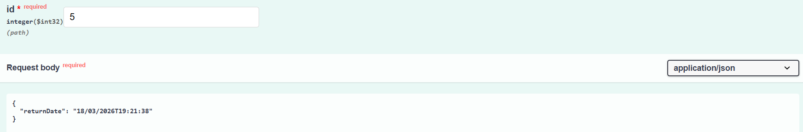

**Response Body**
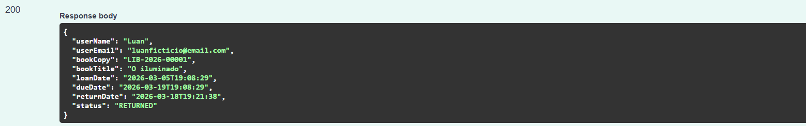

**Request Body com infração**
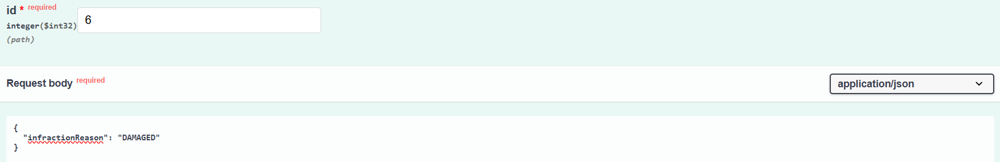

### User
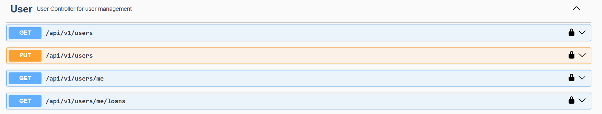

#### GET ```/api/v1/users/me```
**Descrição**: O usuário pode ver suas informações do seu perfil.

**Response Body**
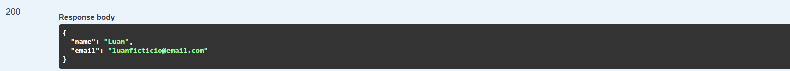

#### GET ```/api/v1/users/me/loans```
**Descrição**: O usuário pode ver todos os empréstimos que estão vinculados a ele.

**Response Body**
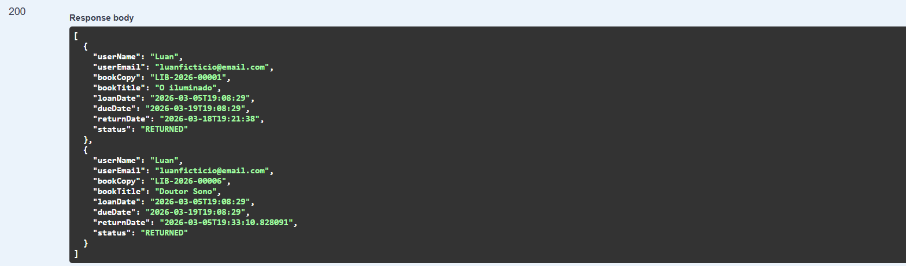

## :repeat: Github Actions

No projeto está configurado um workflow de integração contínua e lançamento semântico. Cada etapa é dependente da anterior, então, se uma etapa falhar, a seguinte não irá acontecer.
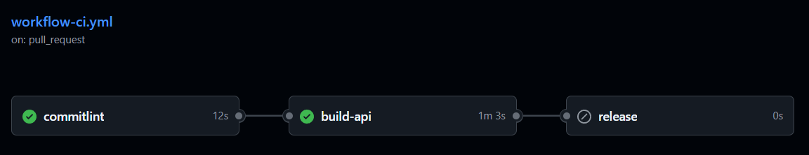

#### 1. Verificação de Conventional Commits com commitlint
A primeira etapa é centrada na verificação de commits feitos pelo usuário. Para todo push, é verificado o último commit, e para todo Pull Request são verificados todos os commits.

#### 2. Build da Aplicação
A segunda etapa é responsável por fazer a construção da aplicação utilizando o Docker, caso o build da aplicação não seja executado com sucesso, essa etapa falhará.

#### 3. Semantic Release
A terceira etapa é o lançamento semântico das versões da API, ficando responsável pelo rastreio de alterações(Breaking change, features, fixes) e a documentação dessas mudanças em [CHANGELOG.md](CHANGELOG.md).
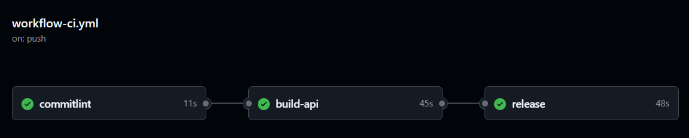

## :rocket: Próximos passos

Para esse projeto, tenho definidos algumas melhorias e implementações.

- Testes unitários;
- Testes de integração;
- Criação de filtros (ex: buscar todos os livros para determinado gênero/autor/editora);
- 

